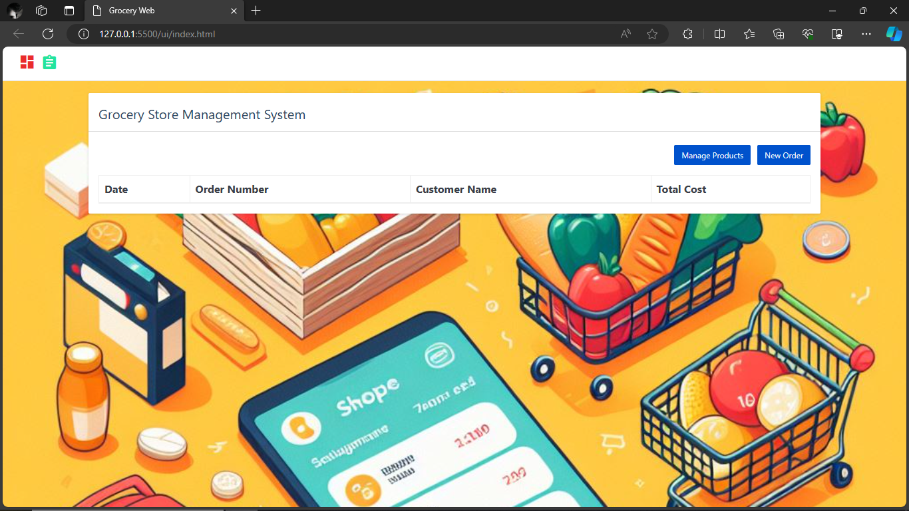

# python_projects_grocery_webapp

In this python project, we will build a grocery store management application. It will be 3 tier application,
1. Front end: UI is written in HTML/CSS/Javascript/Bootstrap
2. Backend: Python and Flask
3. Database: mysql



### Installation Instructions

Download mysql for windows: https://dev.mysql.com/downloads/installer/

`pip install mysql-connector-python`

### Exercise 

The grocery management system that we built is functional but after we give it to users for use, we got following feedback. The exercise for you to address this feedback and implement these features in the application,
1. **Products Module**: In products page that lists current products, add an edit button next to delete button that allows to edit current product
2. **Products Module**: Implement a new form that allows you to add new UOM in the application. For example you want to add **Cubic Meter** as a new UOM as the grocery store decided to start selling **wood** as well. This requies changing backend (python server) and front end (UI) both.
3. **Orders Module**: When you place an order it doesn't have any validation. For example one can enter an order with empty customer name. You need to add validation for customer name and invalid item name or not specifying a quantity etc. This is only front end UI work.
4. **Orders Module**: In new order page there is a bug. When you manually change total price of an item it doesn't change the grand total. You need to fix this issue.
5. **Orders Module**: In the grid where orders are listed, add a view button in the last column. On clicking this button it should show you order details where individual items in that order are listed along with their price/quantity etc.


First of all you have to download mySQL Workbench : https://dev.mysql.com/downloads/file/?id=516927

## after installation has been done :
### 1.create a database as grocery_store or gs like watever you want but naming should be meaningful
#### command to create db in workbench : 
`create database gs;`
        (or)
`create schema gs;`

### 2.create tables (order_details, orders, products, uom) in it :
1. Create products table :- 
```
CREATE TABLE `products` (
  `product_name` varchar(100) NOT NULL,
  `product_id` int NOT NULL AUTO_INCREMENT,
  `uom_id` int NOT NULL,
  `price_per_unit` double NOT NULL,
  PRIMARY KEY (`product_id`),
  KEY `fk_uom_id_idx` (`uom_id`),
  CONSTRAINT `fk_uom_id` FOREIGN KEY (`uom_id`) REFERENCES `uom` (`uom_id`) ON DELETE RESTRICT ON UPDATE RESTRICT
) ENGINE=InnoDB AUTO_INCREMENT=8 DEFAULT CHARSET=utf8mb4 COLLATE=utf8mb4_0900_ai_ci;
```


2. Create UOM(unit of mesurment) Table :- 
```
CREATE TABLE `uom` (
  `uom_id` int NOT NULL AUTO_INCREMENT,
  `uom_name` varchar(45) NOT NULL,
  PRIMARY KEY (`uom_id`)
) ENGINE=InnoDB DEFAULT CHARSET=utf8mb4 COLLATE=utf8mb4_0900_ai_ci;
```


3. Create orders table :- 
```
CREATE TABLE `orders` (
  `order_id` int NOT NULL AUTO_INCREMENT,
  `customer_name` varchar(45) NOT NULL,
  `total` double NOT NULL,
  `datetime` datetime NOT NULL,
  PRIMARY KEY (`order_id`)
) ENGINE=InnoDB AUTO_INCREMENT=2 DEFAULT CHARSET=utf8mb4 COLLATE=utf8mb4_0900_ai_ci; 
```


4. Create order_details Table :- 
```
CREATE TABLE `order_details` (
  `order_id` int NOT NULL,
  `product_id` int NOT NULL,
  `quantity` int NOT NULL,
  `total_price` double NOT NULL,
  PRIMARY KEY (`order_id`),
  KEY `fk_product_id_idx` (`product_id`),
  CONSTRAINT `fk_order_id` FOREIGN KEY (`order_id`) REFERENCES `orders` (`order_id`) ON UPDATE RESTRICT,
  CONSTRAINT `fk_product_id` FOREIGN KEY (`product_id`) REFERENCES `products` (`product_id`) ON UPDATE RESTRICT
) ENGINE=InnoDB DEFAULT CHARSET=utf8mb4 COLLATE=utf8mb4_0900_ai_ci;
```
* after creating all tables add some possible entries in it, so we can further practice on it *

# Part 2
## Open this Documentation : 
<a href="https://dev.mysql.com/doc/connector-python/en/connector-python-example-connecting.html">Click Here</a>

*so in this step like we do (add details in tables) using workbench software now we have to do same thing using python api.*
so to achieve this we have to install mySQL connector module for python 
#### command to install mysql connector module for python :
`pip install mysql-connector-python`

we have two folders named "ui" and "backend" right
1. open backend folder
2. create products_dao.py file init


now we are going to connect our database and mange products through products_dao.py :
1. paste this code in your products__dao.py file :
```
import mysql.connector

cnx = mysql.connector.connect(user='root'password='root',
    host='127.0.0.1',
    database='gs')
cnx.close()
```
2. Run it

note : username and password and database_name must be asitis like you have created while u installing mySql_workbench software

after running it if you get any error it means you have not done the steps perfectly.
if you did all things good then you shoud see output as blank because we just connected to database, we didn't printed anythign yet.

### Executing Query through python
after creating connection we have to execute queries right!, so we used a variable cnx to store this connection.
so we have `.execute()` method through which we can run our queries.
example :- 
```
import mysql.connector

cnx = mysql.connector.connect(user='root', password='root',
        host='127.0.0.1',
        database='gs')

cursor = cnx.cursor()
query = "select * from gs.products"

cursor.execute(query)
```
*once query is executed the results are in cursor.*
### Printing Resutls of cursor :
So to print those results or we can say that to itrate through those touples we can make use of foreach loop.
note: here touples mean each colum_name of our table which has multiple entries.

example :-
```
import mysql.connector

cnx = mysql.connector.connect(user='root', password='root',
                              host='127.0.0.1',
                              database='gs')

cursor = cnx.cursor()
query = "select * from gs.products"

cursor.execute(query)

for(product_id, name, uom_id, price_per_unit) in cursor:
    print(product_id,name,uom_id,price_per_unit)
cnx.close()
```

**after our work we have to close the connection that why i have used `cnx.close()` method.**


